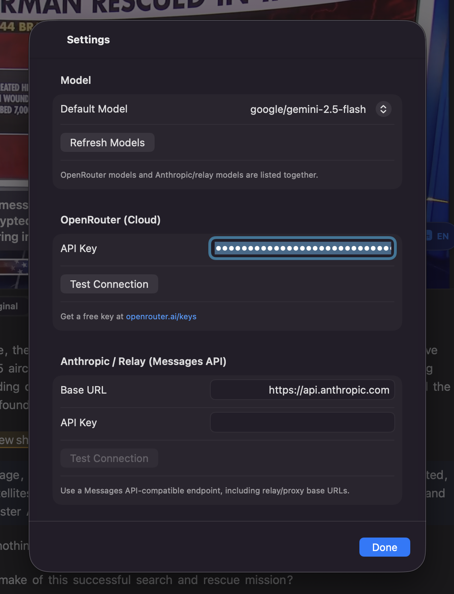
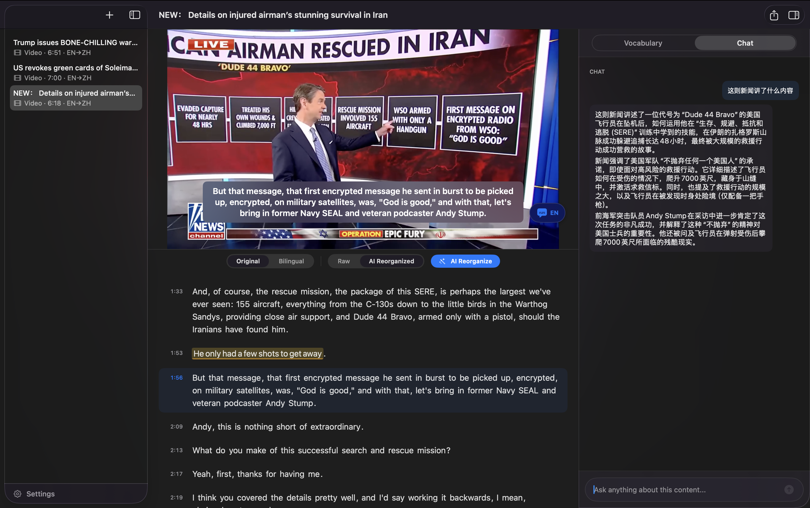

# ListenWise

A macOS app for language learning through speech-to-text transcription, AI-powered vocabulary and sentence analysis, and bilingual subtitles.

Supports multiple languages (English, Japanese, French, German, Spanish, Korean) with per-story language settings.


## Features

- **Speech-to-Text** — On-device transcription using Apple Speech framework with multi-language support
- **Video Playback with Subtitles** — Built-in player with real-time subtitle overlay, supports source/target/bilingual display modes
- **AI Transcript Reorganization** — Merges fragmented speech into proper sentences while preserving subtitle timing
- **Word Learning** — Click or drag to select words/phrases, get structured AI explanations (definition, context, examples, collocations)
- **Sentence Analysis** — Select a full sentence and the AI explains its structure, grammar points, and key phrases
- **Translation** — One-click full transcript translation
- **Chat** — Ask questions about the transcript content directly within the app
- **YouTube Download** — Download videos from YouTube (requires yt-dlp)
- **Export to Markdown** — Export transcript, vocabulary, translations, and chat notes
- **Local Persistence** — All data saved locally as JSON, survives app restarts

## Requirements

- macOS 26.0+ (Tahoe)
- Xcode 26+
- One of the following AI backends:
  - [OpenRouter](https://openrouter.ai) API key (supports Gemini, DeepSeek, Qwen, etc.)
  - An Anthropic Messages API-compatible endpoint with configurable base URL and API key
- [yt-dlp](https://github.com/yt-dlp/yt-dlp) (optional, for YouTube downloads): `brew install yt-dlp`

## Getting Started

### 1. Configure AI Backend

Open **Settings** (bottom-left gear icon) to set up your AI provider. Choose between OpenRouter or an Anthropic-compatible endpoint, then select your preferred default model.



### 2. Create a Story

Click **+** in the sidebar. Choose source and target languages, then either **Import File** for local audio/video or **YouTube** to download by URL. The app transcribes the content on-device.


### 3. Study the Transcript

Once transcription completes, the three-column layout appears — story list on the left, video player with transcript in the center, and vocabulary/chat inspector on the right. Click any line to seek the video to that position.


### 4. AI Reorganize

Click **AI Reorganize** to merge raw transcript fragments into clean, complete sentences. Toggle between **Raw** and **AI Reorganized** views. Selecting AI Reorganized auto-triggers reorganization if not done yet.


After reorganization, sentences have proper boundaries and the subtitle overlay updates accordingly.


### 5. Vocabulary and Sentence Analysis

Click any word to mark it, or drag across words to select a phrase/sentence. Click **Ask AI** — the AI decides whether each item is a word or sentence and returns the appropriate explanation:

- **Words**: definition, context usage, example sentences, collocations
- **Sentences**: structure analysis, grammar points, key phrases, translation


### 6. Chat

Switch to the **Chat** tab to ask questions about the transcript. The AI uses the transcript as context to answer in your target language.



### 7. Export

Click **Export Notes** in the toolbar to save everything as Markdown — transcript, vocabulary cards, translations, and chat history.

## Supported AI Models

### OpenRouter
- `google/gemini-2.5-flash` / `gemini-2.5-flash-lite`
- `deepseek/deepseek-v3.2`
- `qwen/qwen3.6-plus:free`
- And many more at [openrouter.ai/models](https://openrouter.ai/models)

### Anthropic / Relay
- `claude-opus-4-6` / `claude-sonnet-4-6` / `claude-haiku-4-5`
- Works with the official API or any compatible relay/proxy

## Architecture

```
ListenWise/
├── Models/
│   ├── StoryModel.swift          # Story data model, language config, Markdown export
│   └── StoryStore.swift          # JSON persistence
├── Views/
│   ├── ContentView.swift         # 3-column layout with sidebar
│   ├── TranscriptView.swift      # Main learning interface
│   ├── TranscriptView+AI.swift   # AI operations (translate, reorganize, word/sentence learning, chat)
│   ├── SettingsView.swift        # API keys and model selection
│   └── YouTubeDownloadView.swift # YouTube download sheet
├── Helpers/
│   ├── Helpers.swift             # Subtitle exporter, JSON parsing, word flow UI, card views
│   ├── AIProvider.swift          # OpenRouter / Anthropic API streaming
│   └── ListenWiseApp.swift       # App entry point
└── Recording and Transcription/
    └── Transcription.swift       # Apple Speech framework integration
```

## Data Storage

Stories are saved as JSON in `~/Library/Application Support/ListenWise/Stories/`. Exported Markdown goes to `~/Documents/ListenWise Exports/`.

## Credits

Based on Apple's [WWDC25 sample code](https://developer.apple.com/videos/play/wwdc2025/277) for SpeechAnalyzer, extended with AI-powered language learning features.

## License

See [LICENSE](LICENSE.txt) for details.
